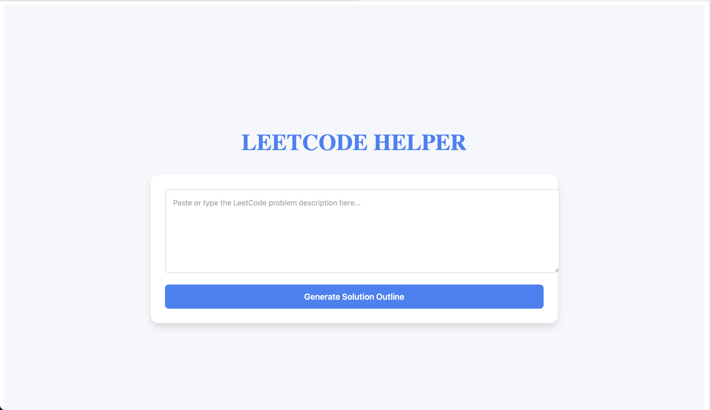
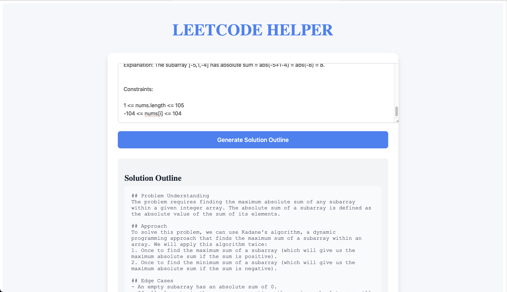

# LeetCode Helper

LeetCode Helper is a web-based application that generates solution outlines for LeetCode problem descriptions. It uses a Flask backend powered by Groq API and a React frontend for an interactive user experience.

---

## Features
- Accepts LeetCode problem descriptions as input.
- Generates solution outlines including problem understanding, approach, edge cases, and time/space complexity.

---

## Prerequisites
- Python 3.12+
- Node.js and npm
- Groq API Key

---

## Setup Instructions

### 1. Clone the Repository
```bash
git clone git@github.com:Pakshalbhandari/leetcode-helper.git
cd leetcode-helper
```

### 2. Backend Setup
#### Navigate to the backend directory:
```bash
cd backend
```

#### Create a .env file and add your Groq API key:
```bash
GROQ_API_KEY=your_api_key_here
```

#### Start the backend server:
python3 backend.py

### 3. Frontend Setup
#### Navigate to the frontend directory:
```bash
cd frontend
```

#### Install dependencies:
```bash
npm install
```

#### Start the frontend development server:
```bash
npm run dev
```

## Usage

### Open your browser and visit:
```bash
http://localhost:3000
```

Paste or type a LeetCode problem description into the text area.

Click the "Generate Solution Outline" button to see the solution outline.




